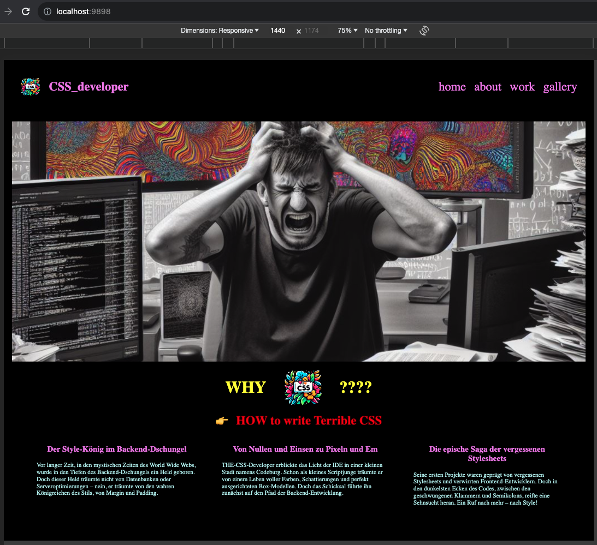
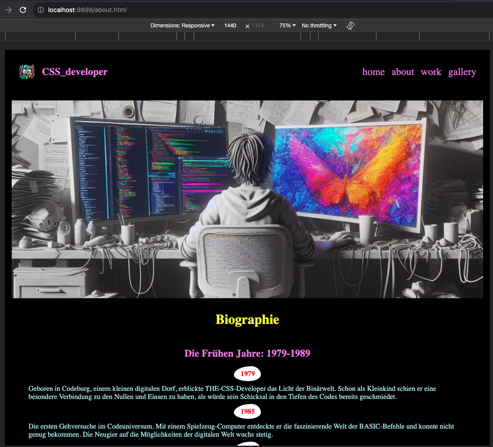
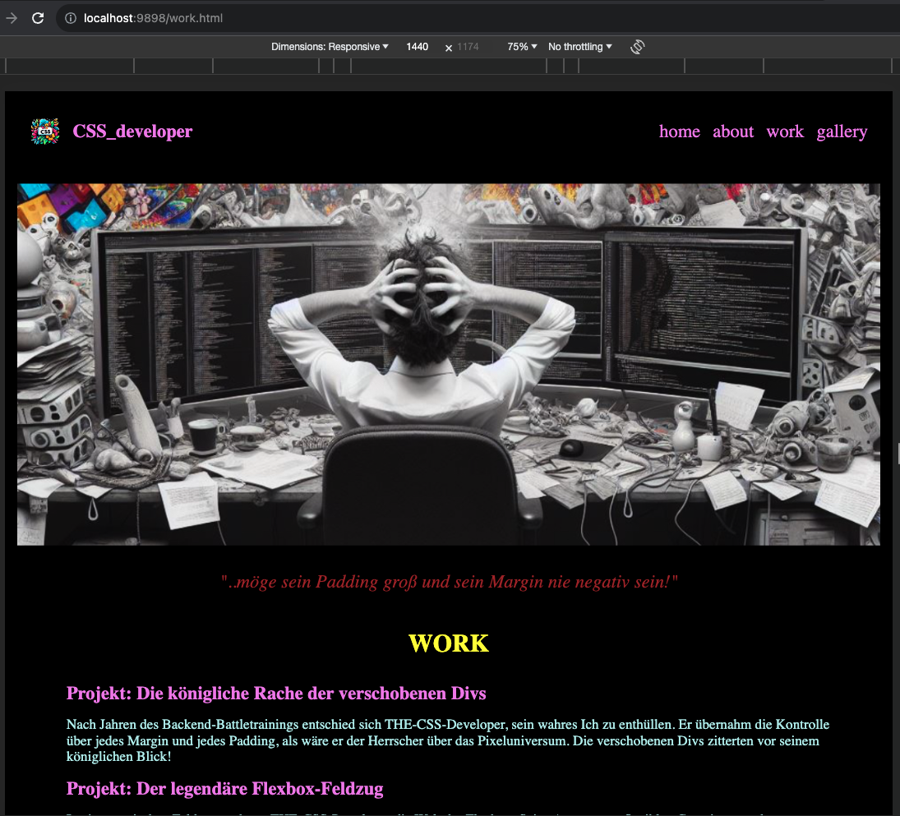
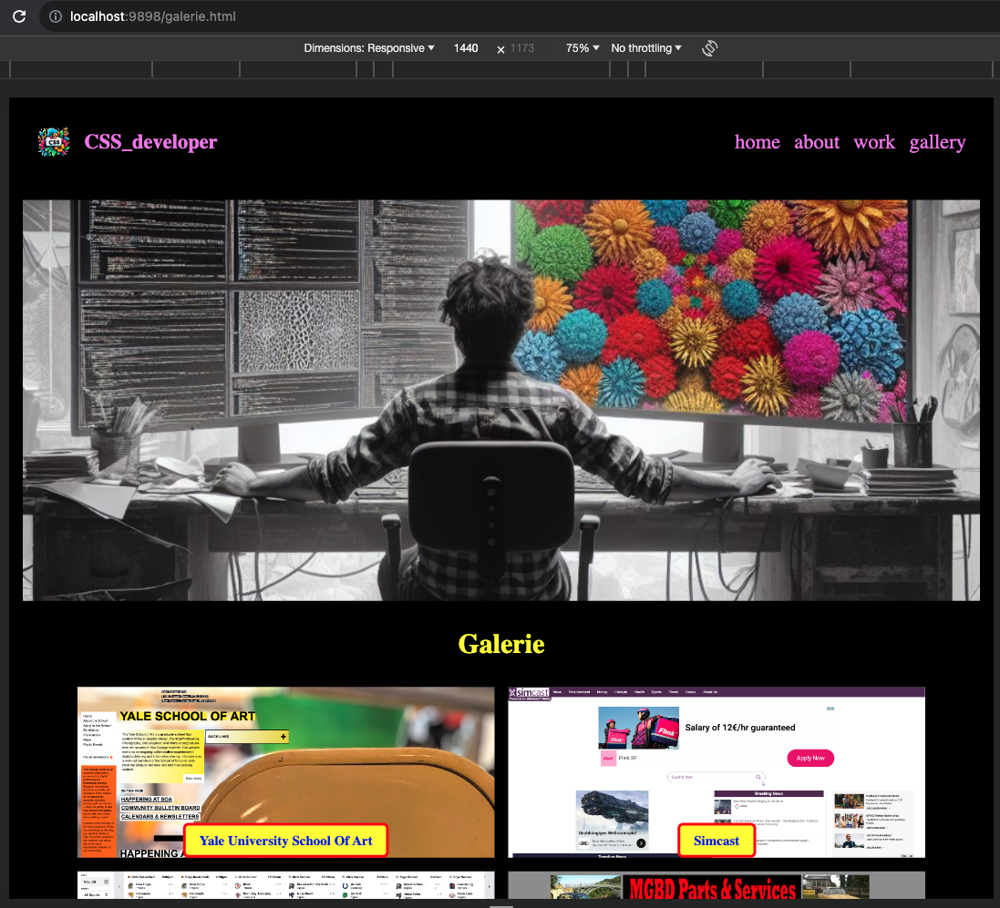
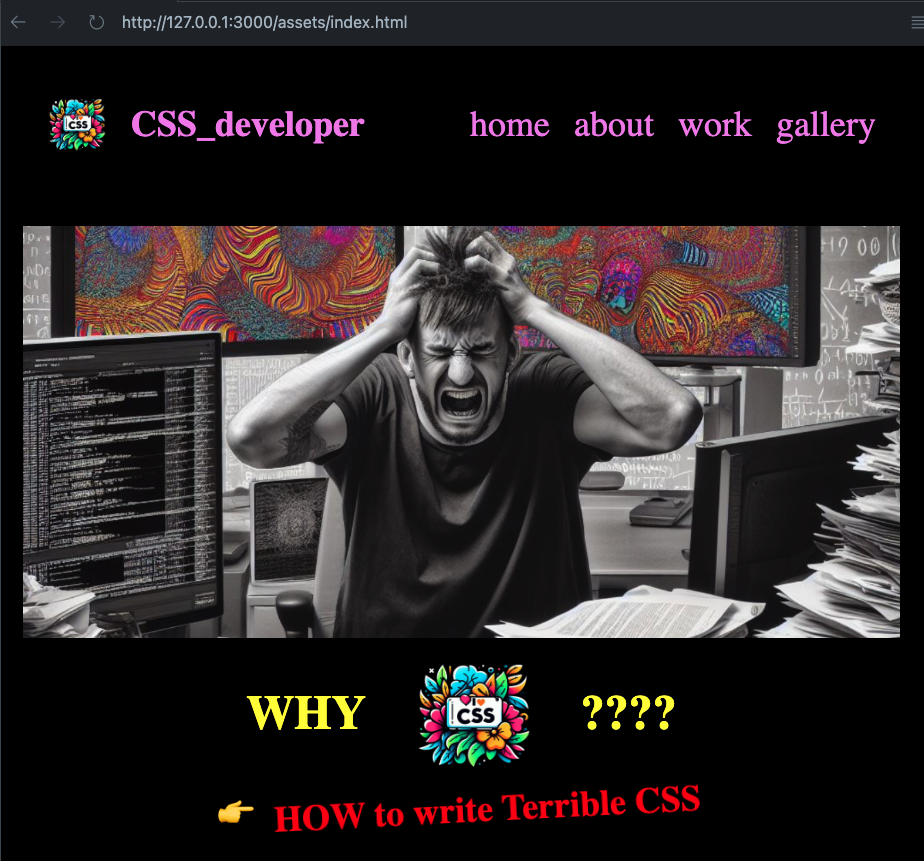

# CSS_Developer (Express Static Server Port 9898)

A joke and ironic page about the abversion of certain programmers and backend developers to css or giving applications some love and "chichi". 🤡

Practice using express and static files

Header images and Logo are done with Image Creator of Bing

# Server

# Live Server

🤡🤡🤡🤡🤡🤡🤡🤡🤡🤡🤡🤡🤡🤡🤡🤡
